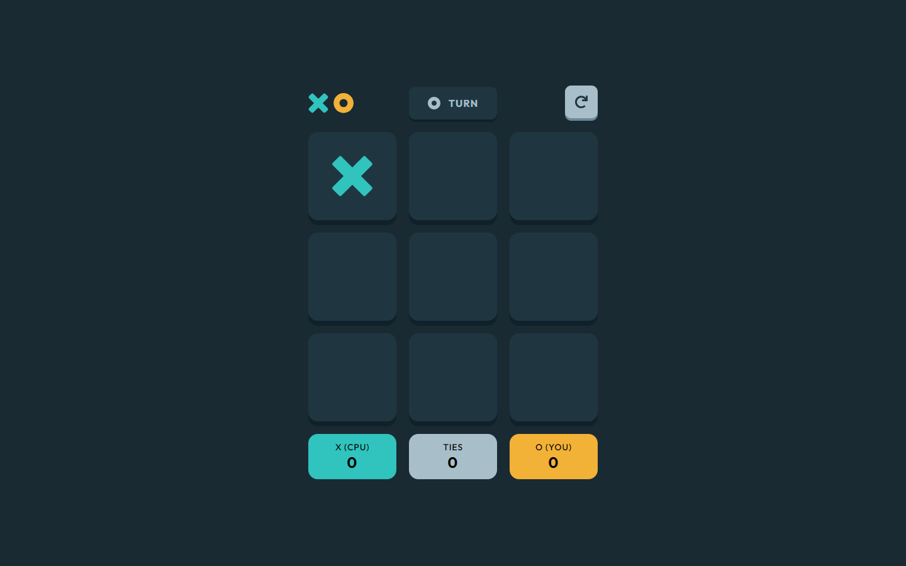
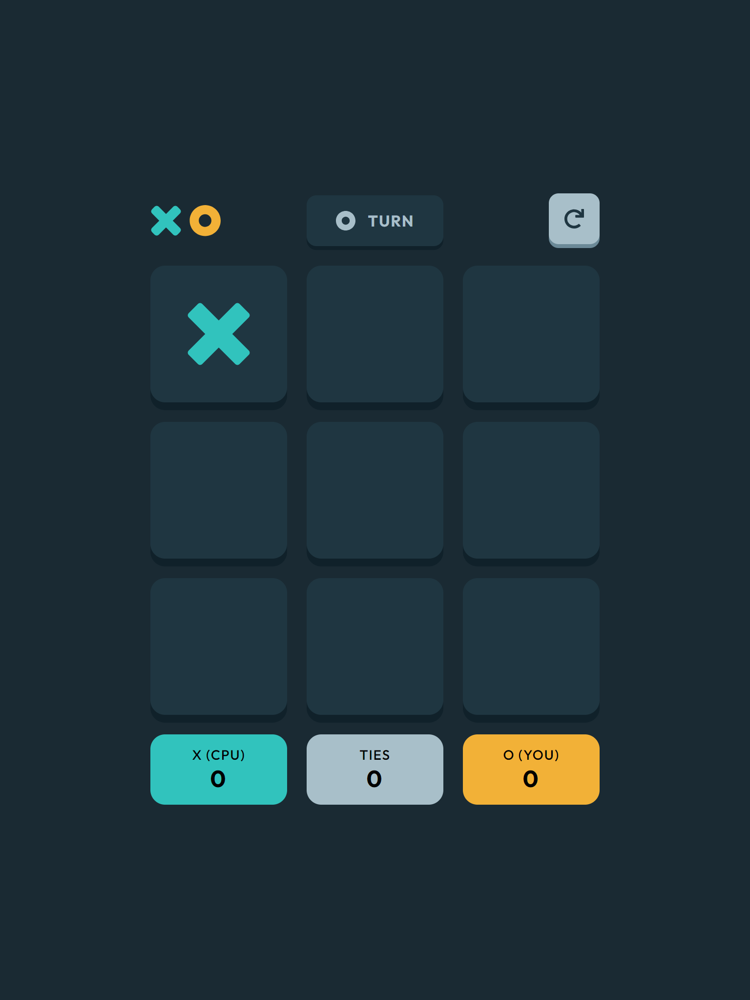

# Tic Tac Toe

Your challenge is to build out this Tic Tac Toe game and get it looking as close to the design as possible.

You can use any tools you like to help you complete the challenge. So if you've got something you'd like to practice, feel free to give it a go.

## Summary

-   [Overview](#overview)
    -   [Challenge](#challenge)
    -   [Screenshot](#screenshot)
    -   [Links](#links)
-   [My Process](#my-process)
    -   [Built With](#built-with)
    -   [What I Learned](#what-i-learned)
    -   [Continued Development](#continued-development)
    -   [Useful Resources](#useful-resources)
-   [Author](#author)
-   [Acknowledgments](#acknowledgments)

## Overview

### Challenge

Your users should be able to:

-   View the optimal layout for the game depending on their device's screen size
-   See hover states for all interactive elements on the page
    Play the game either solo vs the computer or multiplayer against another person
-   Bonus 1: Save the game state in the browser so that it’s preserved if the player refreshes their browser
-   Bonus 2: Instead of having the computer randomly make their moves, try making it clever so it’s proactive in blocking your moves and trying to win

### Screenshot

### Links

-   [Source code](https://github.com/Otaviano-Manoel/tic_tac_toe)
-   [Live website]()

## My Process

### Built With

### What I Learned

#### Challenges and Experiences with Express and Sockets

This project was my first experience with creating a server using Express and Sockets. It was a challenging but incredibly enriching process. Working with Express and implementing sockets provided me with a deeper understanding of real-time communication and server structure.

#### Tackling React Routes

React routes were a significant initial challenge. I faced numerous difficulties but managed to overcome them with persistence. In the end, I implemented a solution that I was quite pleased with. This experience taught me the importance of navigation and routing in React applications.

#### Incrementing the Project on GitHub

GitHub was an essential tool during development. Constantly incrementing the project on GitHub not only saved my progress at critical moments but also allowed me to document and review the code effectively. I learned the importance of versioning code and maintaining a clear history of changes.

#### First Server Deployment on Render

I completed the project with my first server deployment on Render. It was an exciting experience to see the server running in production. I learned about the deployment process and the necessary precautions to ensure the application is stable and accessible.

### Continued Development

#### Next Steps

Despite all the achievements, I recognize that there is still much to learn about server application. I am committed to further developing my skills in this area to enhance my future projects even more.

#### Conclusion

This project has been an intense learning journey, filled with challenges and accomplishments. From setting up the server with Express and Sockets to resolving React routes and the final deployment on Render, each step provided me with new knowledge and skills. I am excited to apply everything I have learned in future projects.

### Useful Resources

-   [MDN Web Docs](https://developer.mozilla.org/) - A complete and reliable reference for HTML, CSS, and JavaScript functions and properties. I used it extensively to better understand certain functionalities and best practices.

-   [W3Schools](https://www.w3schools.com/) - A valuable resource for learning and referencing HTML, CSS, and React functions. Their explanations and examples helped to quickly clarify doubts.

-   [React Documentation](https://reactjs.org/docs/getting-started.html) - The official React documentation was essential for understanding how to use hooks, routing, and other React features correctly and efficiently.

-   [ChatGPT](https://www.openai.com/chatgpt) - I used ChatGPT to solve some complex logic and problems I encountered during development. It was helpful for obtaining solutions and code formatting suggestions.
-   [FreeSound](https://freesound.org/) - I used Freesound to find and incorporate various audio clips into my project. It was invaluable for sourcing high-quality sounds and ensuring appropriate attribution.

# Credits

### Sound Title: "Platform Game Theme Loop 2"

-   Author: [Mrthenoronha](https://freesound.org/people/Mrthenoronha/)
-   License: [Creative Commons Attribution License (CC BY-NC 4.0)](https://creativecommons.org/licenses/by-nc/4.0/)

### Sound Title: "win"

-   Author: [mehraniiii](https://freesound.org/people/mehraniiii/)
-   License: [Creative Commons Attribution License (CC0)](http://creativecommons.org/publicdomain/zero/1.0/)

### Sound Title: "Retro You Lose SFX"

-   Author: [suntemple](https://freesound.org/people/suntemple/)
-   License: [Creative Commons Attribution License (CC0)](http://creativecommons.org/publicdomain/zero/1.0/)

### Sound Title: "Finger Snap"

-   Author: [DRFX](https://freesound.org/people/DRFX/)
-   License: [Creative Commons Attribution License (CC BY-NC 4.0)](http://creativecommons.org/publicdomain/zero/1.0/)

## Author

[Frontend Mentor - @Otaviano-Manoel](https://www.frontendmentor.io/profile/Otaviano-Manoel)

## Acknowledgments

I thank everyone who took the time to view my project. I am in the learning phase and continue to seek to improve my skills to achieve clearer and more functional code. Your feedback is very valuable to me and will be fundamental to my growth as a developer.
